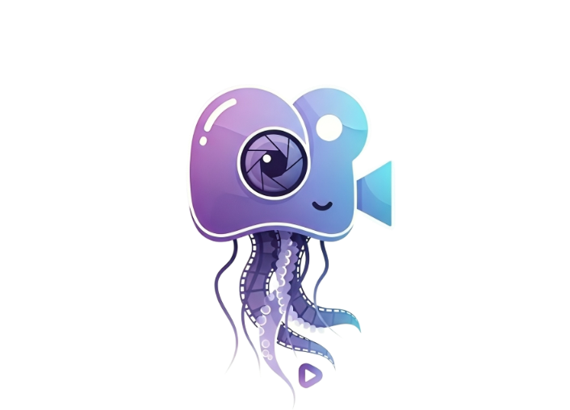
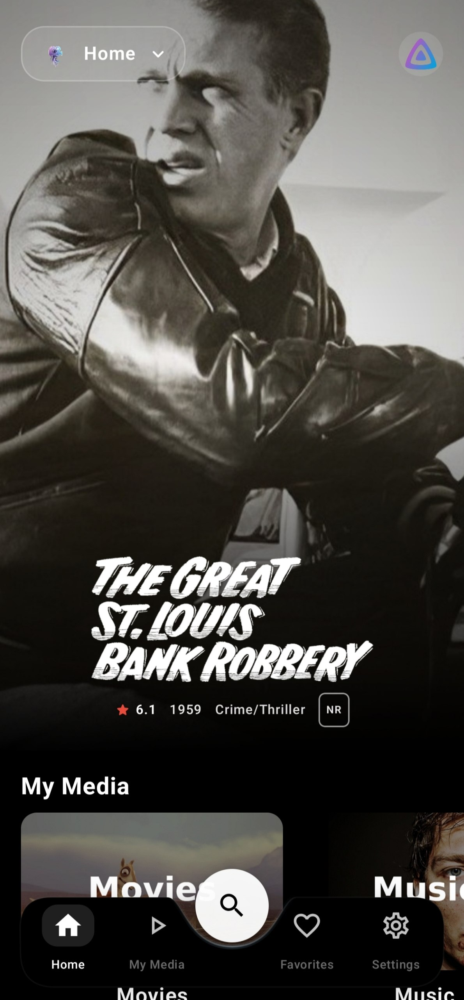
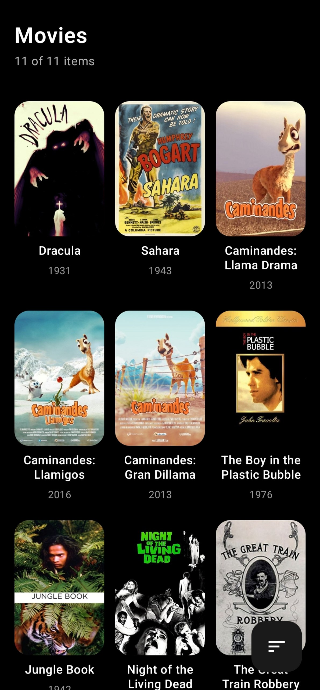
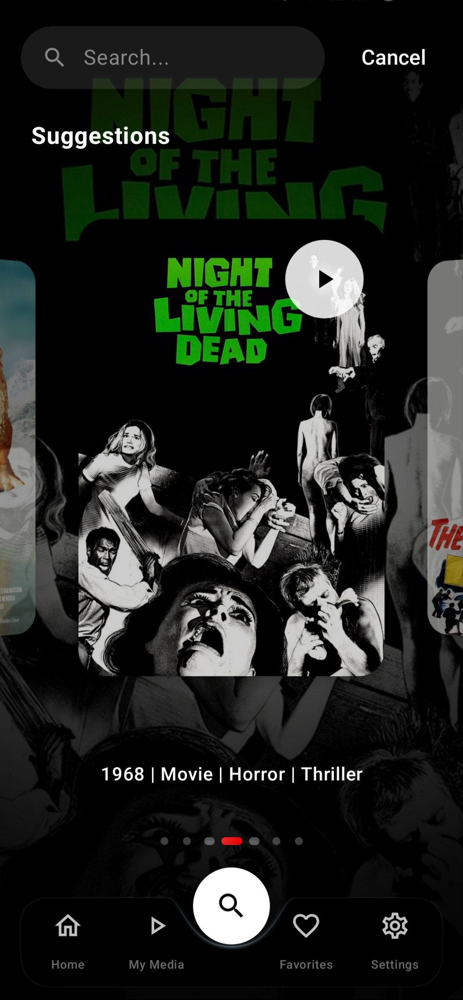
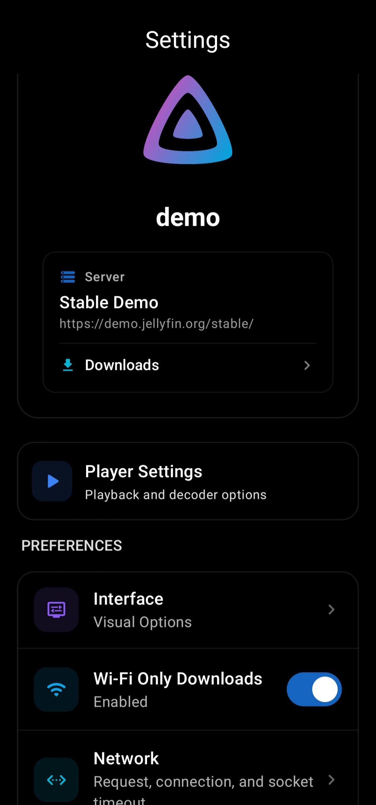
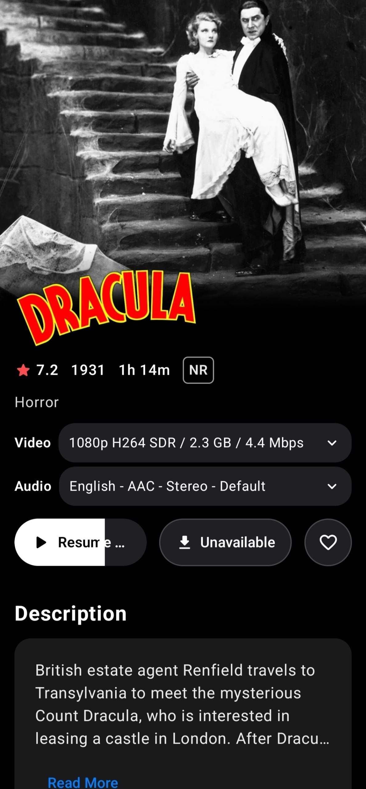
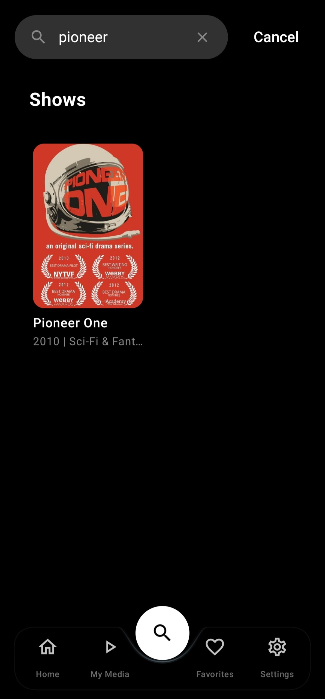

<p align="center">
  
</p>

<p align="center"><strong>JellyCine</strong></p>
<p align="center">Jetpack Compose Android client for Jellyfin and Emby, focuses on a fast, fluid UI and smooth playback.</p>

<p align="center">
  <a href="https://www.buymeacoffee.com/Sureshfizzy">
    
  </a>
  <a href="https://www.patreon.com/c/sureshs/membership">
    
  </a>
</p>

<p align="center">
  <a href="https://play.google.com/store/apps/details?id=com.jellycine.app">
    
  </a>
</p>

## Features

- Jellyfin and Emby support with automatic endpoint resolution
- Spatial audio passthrough when supported by the device/output route
- Compose-first UI with Home, My Media, Search, Favorites, and Settings sections
- Offline-aware navigation mode that falls back to downloaded content when network is unavailable
- Immersive search experience with suggestions, live results, and categorized results
- Offline downloads with queueing, pause/resume/cancel, and persistent state recovery
- Season and series download actions with storage estimation before enqueueing
- Media3 ExoPlayer playback with Jellyfin FFmpeg extension integration
- In-player streaming quality selection, audio transcoding controls, and configurable player cache
- Subtitle styling controls with improved subtitle and audio track handling
- Google Cast support with inline remote playback controls
- Gesture controls in player (seek, volume, brightness), lock mode, and start-maximized preference
- HDR and Dolby Vision capability analysis with fallback handling

## Screenshots

<div align="center">
  
  
  
</div>

<div align="center">
  
  
  
</div>

## Project Structure

- `app`: Android app module (Compose UI, navigation, settings, downloads, player screens)
- `data`: APIs, repositories, models, DataStore/shared preference backed configuration
- `core`: Shared player/auth utilities (player preferences, codec/HDR helpers, audio device detection)

## Tech Stack

- Kotlin, Coroutines, Flow
- Jetpack Compose + Material 3 + Navigation Compose
- Hilt + KSP for DI/code generation
- Retrofit 3 + OkHttp 5
- Coil 3 for image loading
- Media3 ExoPlayer (`exoplayer`, `ui`, `session`, `dash`, `hls`, `smoothstreaming`, `effect`)
- `org.jellyfin.media3:media3-ffmpeg-decoder` extension

## Getting Started

### Prerequisites

- Android Studio (latest stable recommended)
- JDK 17
- Android SDK platform for API 36

### Build and Run

1. Clone the repository.
2. Open it in Android Studio.
3. Let Gradle sync complete.
4. Select a device/emulator (Android 8.1+).
5. Run the `app` module.

CLI build:

```bash
./gradlew :app:assembleDebug
```

Debug and release APKs are named as:

- `jellycine-debug-<version>.apk`
- `jellycine-release-<version>.apk`

## Privacy

See [PRIVACY](PRIVACY) for the current privacy policy.

## Contributing

Issues and pull requests are welcome. For large feature work, open an issue first to align on scope.

## License

This project is licensed under the MIT License. See [LICENSE](LICENSE).
