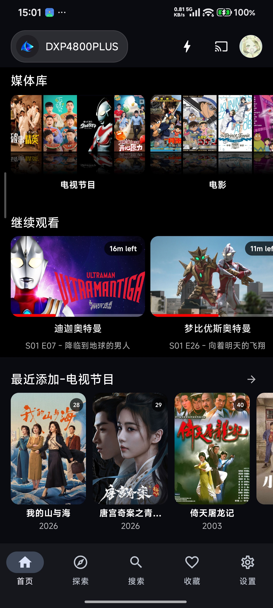
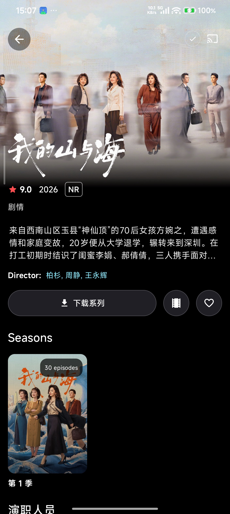
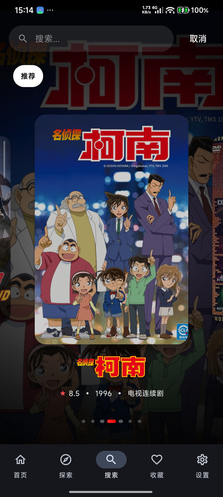
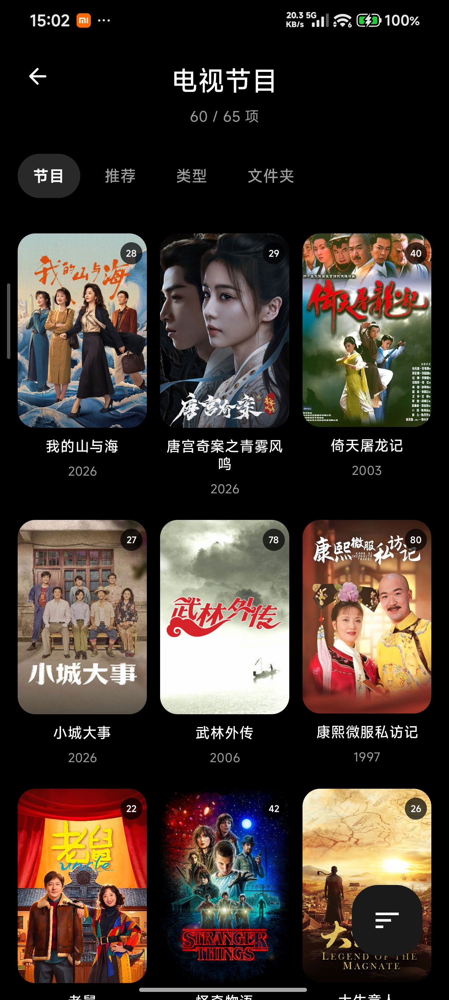
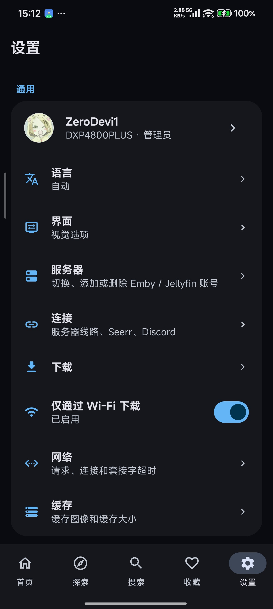
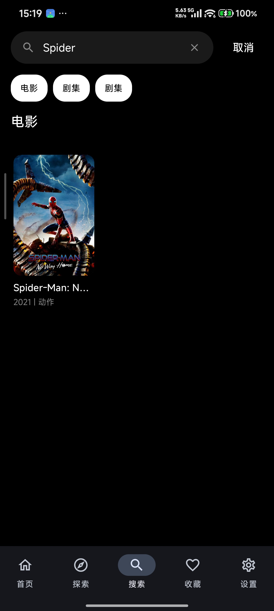

<p align="center">
  
</p>

<h1 align="center">Vela</h1>

<p align="center">
  面向 <strong>Jellyfin</strong> 与 <strong>Emby</strong> 的 Jetpack Compose 客户端，覆盖手机、电视，并在继续向更多平台扩展。
</p>

<p align="center">
  <a href="https://github.com/ZeroDevi1/Vela/releases">
    
  </a>
  <a href="LICENSE">
    
  </a>
</p>

---

## 功能

### 播放

- 以 **MPV** 为主播放器，支持 HDR10 / HDR10+ / Dolby Vision，并显示 HDR 格式标记
- 设备与输出支持时，可直通 TrueHD、DTS-HD、Atmos
- 兼容设备上支持空间音频直通
- MPV 无法渲染时回退到 Media3 ExoPlayer
- 接入 Jellyfin FFmpeg 扩展，覆盖更多编码
- 播放内可选画质、音频转码策略，并可配置播放缓存
- 手势控制（进度、音量、亮度）、锁定模式、启动即最大化
- 存在 IntroDB / TheIntroDB 标记时可跳过片头
- 字幕样式与轨道处理
- Google Cast，以及界面内的远程播放控制

### 发现

- 首页焦点轮播支持 **应用内预告片** 自动播放（手机端最高 720p）
- 详情页提供预告片与花絮
- **为你推荐** 个性化推荐，以及已观看动态
- 基于 Wikidata 的奖项分类
- 沉浸式搜索：联想、实时结果、分类展示
- 收藏页，支持紧凑页头与查看全部

### Seerr

- 发现、搜索、推荐与详情
- 请求标记、请求额度与标题请求
- Seerr 详情页支持预告片

### 下载

- 离线下载：队列、暂停 / 继续 / 取消，以及持久化恢复
- **转码下载**，带画质选择
- 下载画质选择器中可选音轨
- 季与剧集批量下载，并估算占用空间
- 网络不可用时，导航会回退到已下载内容

### 电视

- 面向电视重做的界面，支持方向键与遥控器
- 电影感全幅详情页叠层
- 推荐区域沉浸式背景
- 键盘叠层搜索，结果以轮播呈现
- 焦点英雄卡片可展开，背景交叉淡入淡出

### 多服务器与连接

- 同时支持 Jellyfin 与 Emby，并自动解析访问地址
- 合并版本：在本地选择版本，无需改服务器
- **Discord Rich Presence**（官方 Social SDK）及连接管理
- **管理面板**：实时服务器信息、会话与活动日志

### 平台

| 平台 | 状态 |
|------|------|
| Android 手机 | 稳定 |
| Android 电视 | 稳定 |
| iOS | 开发中 |

---

## 截图

| 首页 | 详情 | 搜索 |
|:---:|:---:|:---:|
|  |  |  |

| 媒体库 | 设置 | 搜索结果 |
|:---:|:---:|:---:|
|  |  |  |

---

## 技术栈

| 层级 | 技术 |
|------|------|
| 语言 | Kotlin 2.3、Coroutines、Flow |
| UI | Jetpack Compose + Material 3 |
| 依赖注入 | Hilt + KSP |
| 网络 | Ktor Client + OkHttp 5 |
| 图片 | Coil 3 |
| 播放器 | MPV（主）、Media3 ExoPlayer（回退） |
| 多平台 | Kotlin Multiplatform（Android + iOS） |

## 目录结构

```
phone/    手机端（Compose 界面、导航、播放器、设置）
tv/       电视端（DPAD、侧栏、电视流程）
data/     API、仓库、模型；多平台网络层
core/     共享播放器、偏好设置与工具
shared/   共享 UI 组件与图片基础设施
iosApp/   iOS 壳工程（开发中）
```

品牌资源在 [`branding/vela/`](branding/vela/)，README 使用的图标来自该目录的重绘成品。

---

## 开始使用

### 环境

- Android Studio（建议最新稳定版）
- JDK 17
- Android SDK（`compileSdk` 37，`targetSdk` 36，`minSdk` 27）

### 构建

```bash
# 手机
./gradlew :phone:assembleDebug

# 电视
./gradlew :tv:assembleDebug
```

本地签名安装（需已连接设备）：

```bash
./scripts/install-release.sh
```

APK 命名：`vela-{phone|tv}-{debug|release}-<version>[-<abi>].apk`

本地签名 release（需 `keystore.properties` 或环境变量 `VELA_STORE_FILE` / `VELA_STORE_PASSWORD` / `VELA_KEY_PASSWORD`）：

```bash
./gradlew :phone:assembleRelease
./gradlew :tv:assembleRelease
```

`keystore.properties` 放在仓库根目录（已 gitignore）：

```
storeFile=vela-release.keystore
storePassword=...
keyAlias=vela
keyPassword=...
```

预编译包见 [GitHub Releases](https://github.com/ZeroDevi1/Vela/releases)。

### 发布

推送与根目录 `build.gradle` 里 `appVersionName` 一致的 `v*` tag（例如当前为 `1.0.1` 则打 `v1.0.1`），或在 Actions 里手动跑 `Release` workflow。CI 会构建已签名 phone / tv APK 并创建 GitHub Release。tag 与 `appVersionName` 不一致会直接失败，缺少签名 secret 也不会产出 unsigned 正式包。

发版前在 [`docs/release-notes.md`](docs/release-notes.md) 增加与版本号对应的 `## x.y.z` 章节，写成面向用户的更新说明（一句简介 + 要点列表），不要贴 commit changelog。CI 用该章节作为 Release 正文，标题为 `Vela v{version}`。缺少对应章节、或内容不像更新说明时，发版会在构建 APK 之前失败。

仓库 Settings → Secrets and variables → Actions 需要：

| Secret | 用途 |
|--------|------|
| `VELA_STORE_FILE_BASE64` | release keystore 的 base64 |
| `VELA_STORE_PASSWORD` | keystore 密码 |
| `VELA_KEY_PASSWORD` | key 密码 |
| `DISCORD_SDK_PASSPHRASE` | 解密 `core/libs/discord_partner_sdk.aar.gpg` |

```bash
# 先把 build.gradle 的 appVersionName / appVersionCode 改到目标版本
# 并在 docs/release-notes.md 顶部增加 ## x.y.z 更新说明，再提交
git tag v1.0.1
git push origin v1.0.1
```

应用内：关于页可检查 GitHub Release，按类型（手机/电视）和架构选择 APK，并可用 gh-proxy 等 CDN 加速下载。

---

## 参与贡献

欢迎提交 Issue 与 Pull Request。较大的功能建议先开 Issue，对齐范围后再动手。

---

## 隐私

隐私说明见 [PRIVACY](PRIVACY)。

## 起源与致谢

本仓库在 [JellyCine](https://github.com/sureshfizzy/JellyCine) 的基础上继续修改与开发，原作者为 [sureshfizzy](https://github.com/sureshfizzy)。感谢原项目作者与各位贡献者打下的基础。

## 许可证

本项目采用 [GNU General Public License v3.0](LICENSE)。
