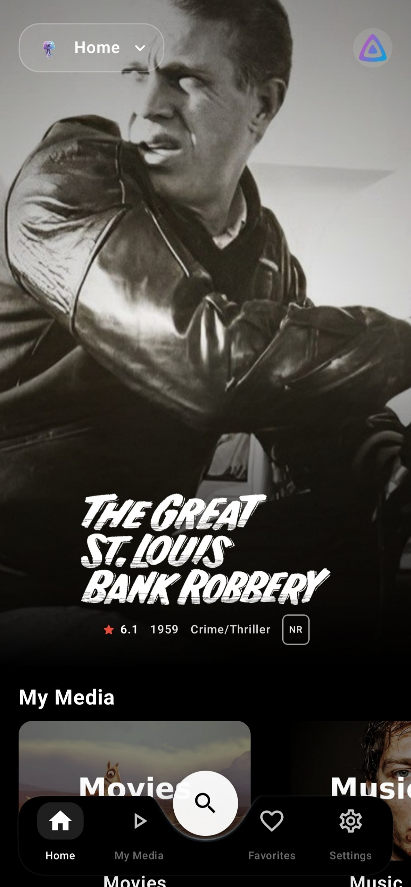
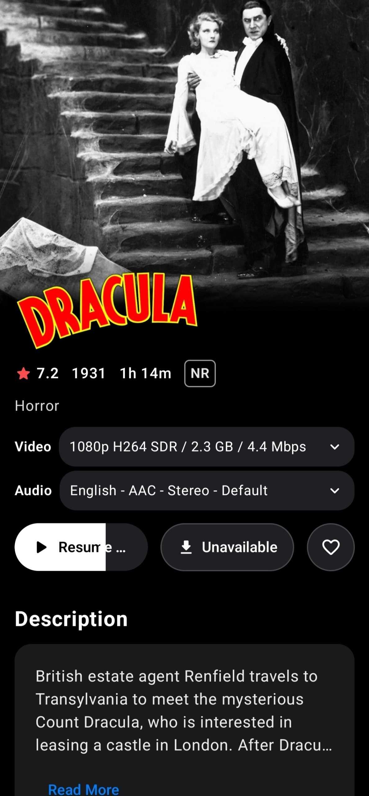
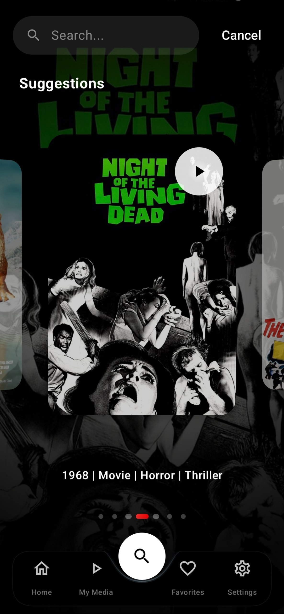
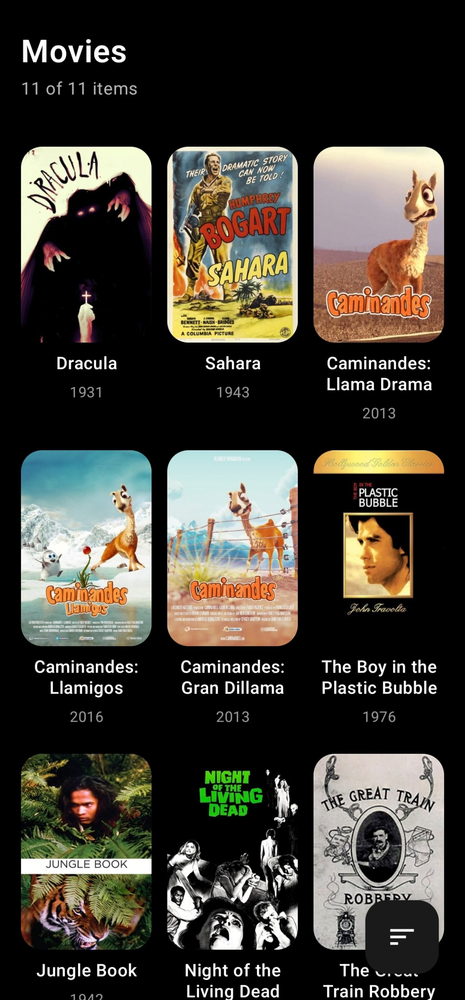
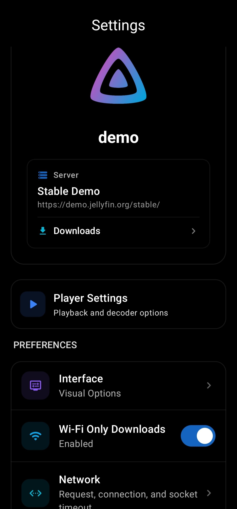
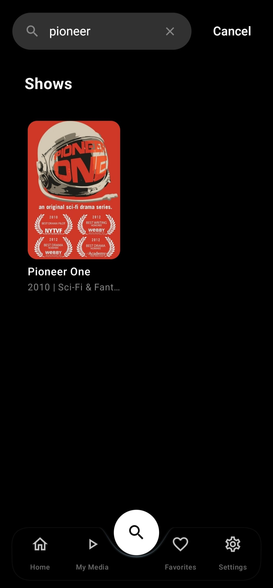

<p align="center">
  
</p>

<h1 align="center">Vela</h1>

<p align="center">
   A Jetpack Compose based client for <strong>Jellyfin</strong> and <strong>Emby</strong> — designed for phone, TV, and beyond.
</p>

<p align="center">
  <a href="https://play.google.com/store/apps/details?id=com.vela.app">
    
  </a>
  <a href="https://github.com/ZeroDevi1/Vela/releases">
    
  </a>
</p>

<p align="center">
  <a href="https://www.buymeacoffee.com/ZeroDevi1">
    
  </a>
  <a href="https://www.patreon.com/c/sureshs/membership">
    
  </a>
</p>

---

## Features

### Playback

- **MPV-based player** with HDR10/HDR10+/Dolby Vision support and HDR format badges
- Audio passthrough (TrueHD, DTS-HD, Atmos) when supported by device/output
- Spatial audio passthrough on compatible devices
- Media3 ExoPlayer fallback when MPV cannot render
- Jellyfin FFmpeg extension integration for broad codec coverage
- In-player quality selection, audio transcoding controls, and configurable player cache
- Gesture controls (seek, volume, brightness), lock mode, and start-maximized preference
- Skip Intro button when IntroDB/TheIntroDB markers are available
- Subtitle styling controls with improved track handling
- Google Cast with inline remote playback controls

### Discovery

- **In-app Trailers** with autoplay in feature carousel (capped to 720p on phones)
- Trailers & Extras section on detail screens
- **For You** personalized recommendations with watched feed
- Awards category powered by Wikidata
- Immersive search with suggestions, live results, and categorized output
- Favorites tab with compact header and view-all navigation

### Seerr Integration

- Discovery, search, recommendations, and detail pages
- Request badges, request limits, and title requests
- Trailer support for Seerr detail items

### Downloads

- Offline downloads with queue, pause/resume/cancel, and persistent state recovery
- **Transcoded download support** with quality picker
- Audio track selection in download quality picker
- Season and series download with storage estimation
- Offline-aware navigation — falls back to downloaded content when network is unavailable

### TV

- Redesigned TV UI with D-pad navigation and remote control support
- Cinematic full-bleed detail screen overlay
- Immersive backdrop for suggestions
- Keyboard overlay search with carousel results
- Feature hero card with card expand and backdrop crossfade

### Multi-Server & Connections

- Jellyfin and Emby support with automatic endpoint resolution
- Merge-version support with local version selection (no server-side changes required)
- **Discord Rich Presence** via official Social SDK with connection management
- **Admin Panel** with live server info, sessions, and activity log

### Platforms

| Platform | Status |
|----------|--------|
| Android Phone | Stable |
| Android TV | Stable |
| iOS | In Development |

---

## Screenshots

<div align="center">
  
  
  
</div>

<div align="center">
  
  
  
</div>

---

## Tech Stack

| Layer | Technology |
|-------|-----------|
| Language | Kotlin 2.3, Coroutines, Flow |
| UI | Jetpack Compose + Material 3 |
| DI | Hilt + KSP |
| Networking | Ktor Client + OkHttp 5 |
| Images | Coil 3 |
| Player | MPV (primary), Media3 ExoPlayer (fallback) |
| Multiplatform | Kotlin Multiplatform (Android + iOS) |

## Project Structure

```
phone/   — Phone app module (Compose UI, navigation, player, settings)
tv/      — TV app module (leanback/DPAD, sidebar rail, TV-specific flows)
data/    — APIs, repositories, models; multiplatform networking
core/    — Shared player, preferences, and utilities
shared/  — Shared UI components and image infrastructure
```

---

## Getting Started

### Prerequisites

- Android Studio (latest stable)
- JDK 17
- Android SDK API 36

### Build

```bash
# Phone
./gradlew :phone:assembleDebug

# TV
./gradlew :tv:assembleDebug
```

APK naming: `vela-{debug|release}-<version>.apk`

---

## Translating

<a href="https://weblate.vela.org/engage/vela/">

</a>

Help translate Vela into your language on [Weblate](https://weblate.vela.org/engage/vela/).

---

## Contributing

Issues and pull requests are welcome. For large feature work, open an issue first to align on scope.

For community discussions and support, see [Discussions](https://github.com/ZeroDevi1/Vela/discussions).

---

## Privacy

See [PRIVACY](PRIVACY) for the current privacy policy.

## Origin and Acknowledgements

Vela is based on the original [JellyCine](https://github.com/sureshfizzy/JellyCine) project by [sureshfizzy](https://github.com/sureshfizzy). We are grateful to the original author and contributors for the foundation on which this project continues to develop.

## License

This project is licensed under the [GNU General Public License v3.0](LICENSE).