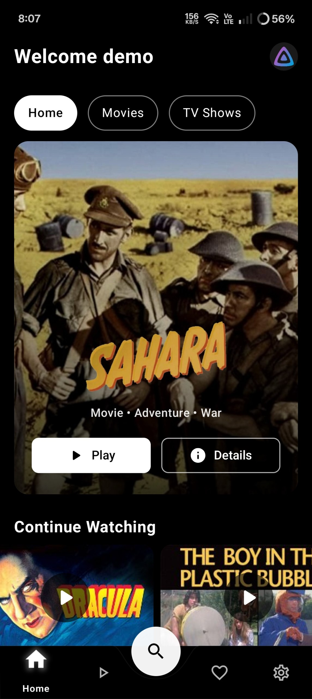
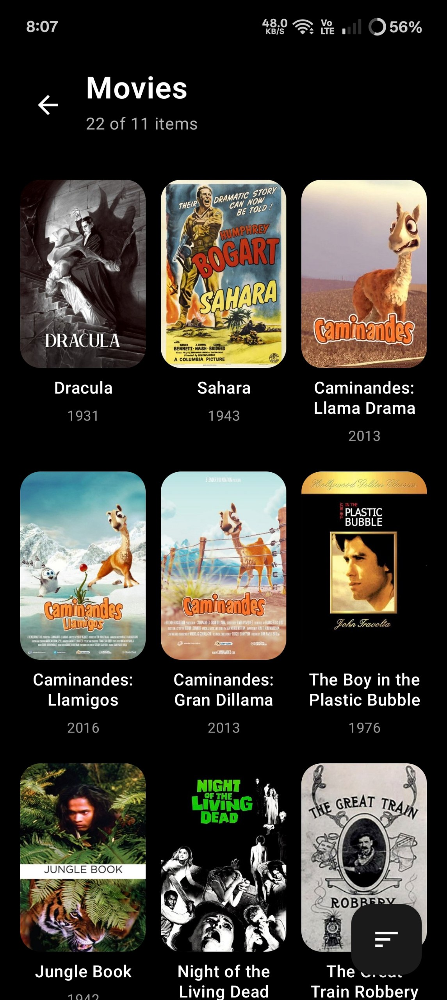
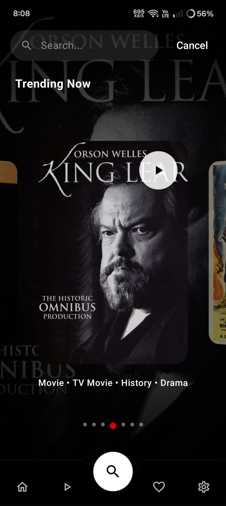
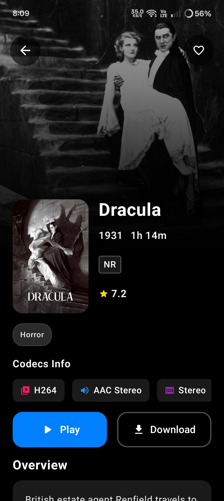
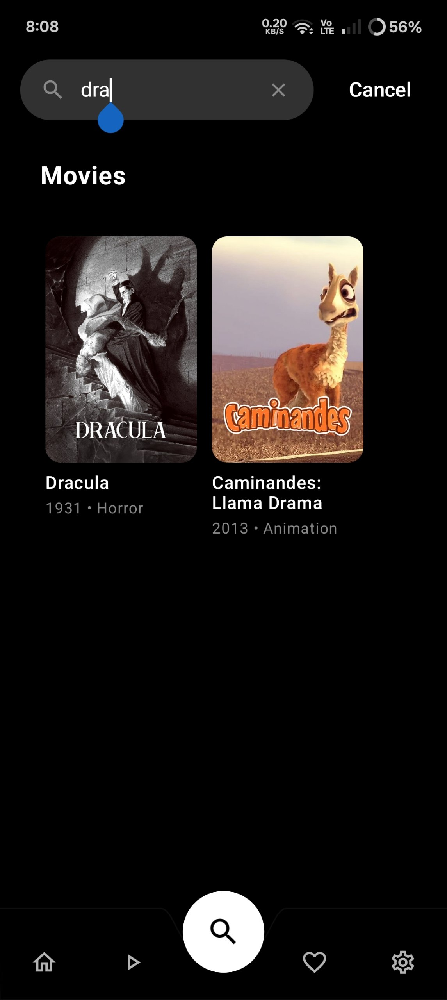

<p align="center">
  
</p>

<p align="center">
  <a href="https://www.buymeacoffee.com/Sureshfizzy">
    
  </a>
  <a href="https://www.patreon.com/c/sureshs/membership">
    
  </a>
</p>

JellyCine is a modern, Jetpack Compose-based Android client for Jellyfin and Emby. It focuses on a fast, fluid UI and smooth playback.

## Features

- Clean, Compose-first UI with Material 3
- Jellyfin + Emby server support
- Browse, search, and view details for Movies and Series
- Search Screen: flexible, instant matching with an immersive layout
- Optimized dashboard/library loading with more stable metadata rendering
- Modernized detail screen layout with improved content presentation
- Efficient image loading with Coil
- Video playback powered by Media3 ExoPlayer (HLS/DASH/SmoothStreaming)
- Gesture-driven player controls (seek/volume/brightness) with custom overlay

## Screenshots

<div align="center">
  
  
  
</div>

<div align="center">
  
  
  
</div>

## Roadmap / TODO

- Improve video player (buffering strategies, subtitle styling/selection, track selection UI, error handling, background audio, PiP)
- Spatial audio support for the video player
- Download functionality for offline viewing

## Architecture Overview

The app uses a modular MVVM architecture with Hilt DI and Kotlin coroutines.

- `app` - UI layer (Compose screens, navigation), view models, and app configuration
- `data` - Networking (Retrofit/OkHttp), repositories, DataStore persistence, Jellyfin/Emby API models
- `core` - Player utilities and shared primitives (e.g., `PlayerUtils` for ExoPlayer setup)
- `setup` - First-run and onboarding helpers (server URL, sign-in flows)

Key technologies:

- Kotlin, Coroutines, Flow
- Jetpack Compose + Material 3 + Navigation Compose
- Hilt for dependency injection
- DataStore (Preferences) for lightweight persistence
- Retrofit + OkHttp (+ logging) for Jellyfin/Emby APIs
- Coil for image loading
- Media3 ExoPlayer for playback (`exoplayer`, `ui`, `dash`, `hls`, `smoothstreaming`)

## Getting Started

### Prerequisites

- Android Studio (Giraffe+ recommended)
- JDK 17
- Android SDK: compileSdk 35, targetSdk 34, minSdk 27

### Build & Run

1. Clone the repository
2. Open the project in Android Studio
3. Let Gradle sync finish
4. Select a device/emulator (Android 8.1+)
5. Run the `app` configuration

Alternatively via CLI:

```bash
./gradlew assembleDebug
```

## Development Notes

- Compose BOM and libraries are declared in `app/build.gradle`
- Hilt is enabled (`com.google.dagger.hilt.android`) with `kapt` for codegen
- DataStore keys store `server_url`, `access_token`, `user_id`
- Media3 `exoplayer-dash`, `exoplayer-hls`, and `exoplayer-smoothstreaming` are included for broad streaming support

## Contributing

Contributions are welcome! Feel free to open issues or PRs for bug fixes, enhancements, or new features. For larger changes, please start a discussion first.

## License

This project is licensed under the terms of the LICENSE file included in the repository.
